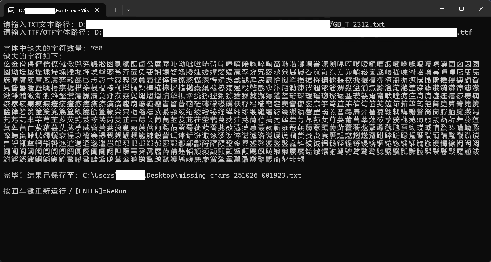

# Font Text Missing Char 字体缺失字符差集分析

## 简介 Introduction

### 功能 Function

- 输入指定文本文件（TXT）与字体文件（TTF、OTF）。

  Input specified text file (TXT) and font file (TTF/OTF).

- 计算文本字符集与字体支持集之间的差集。

  Compare the difference between the character sets of the text and the font.

- 输出字体中缺失的字符列表（TXT，保存至桌面）。

  Output a list (TXT, saved on the Desktop) of missing characters in the font.

### 下载 Download

在[Releases](https://github.com/Fisher4124/Font-Text-Missing-Char/releases)页面下载` Font-Text-Missing-Char.exe`（或[百度网盘](https://pan.baidu.com/s/1Vcq8a1KP7nb8ddWgzD4QPQ)）。

Download `Font-Text-Missing-Char.exe` from the [Releases](https://github.com/Fisher4124/Font-Text-Missing-Char/releases) page.

### 汉字字表 Hanzi TXTs

[NightFurySL2001](https://github.com/NightFurySL2001)所提供的[汉字字表文件](https://github.com/NightFurySL2001/CJK-character-count?tab=readme-ov-file#currently-supported-encoding-standardstandardization-list-支援的编码标准汉字表)（TXT格式）。

[Chinese character table](https://github.com/NightFurySL2001/CJK-character-count?tab=readme-ov-file#currently-supported-encoding-standardstandardization-list-支援的编码标准汉字表) (TXT files) by [NightFurySL2001](https://github.com/NightFurySL2001).

## 著作权声明 Copyright

基于[MIT License](https://opensource.org/license/MIT)协议发布。

Released under the [MIT License](https://opensource.org/license/MIT).
